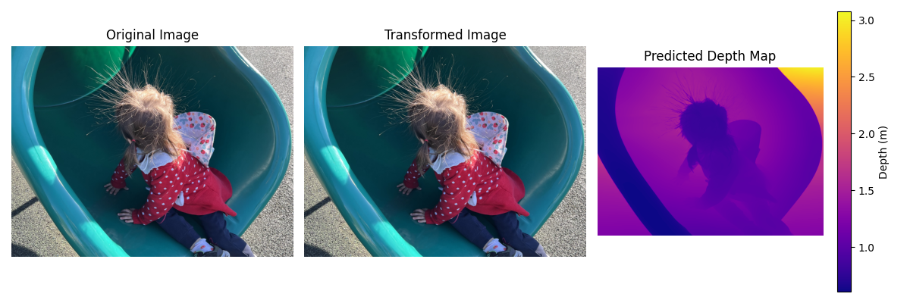

## Depth Pro: Sharp Monocular Metric Depth

This software project accompanies the research paper:
**[Depth Pro: Sharp Monocular Metric Depth in Less Than a Second](https://arxiv.org/abs/2410.02073)**,
_Aleksei Bochkovskii, Amaël Delaunoy, Hugo Germain, Marcel Santos, Yichao Zhou, Stephan R. Richter, and Vladlen Koltun_.



We introduce Depth Pro, a foundation model designed for zero-shot, metric monocular depth estimation. This model generates high-resolution depth maps with exceptional sharpness and rich high-frequency detail. Importantly, it provides depth predictions with an absolute scale—without needing camera metadata like intrinsics—and does so efficiently, producing 2.25-megapixel maps in just 0.3 seconds on a standard GPU. These capabilities are made possible through several innovations: a highly efficient multi-scale vision transformer tailored for dense prediction, a training strategy that blends real and synthetic data to ensure both metric accuracy and precise edge delineation, specialized evaluation metrics focused on boundary precision in depth maps, and cutting-edge single-image focal length estimation.

The repository includes a reference implementation of the model, which has been re-trained. While its performance is comparable to the version described in the paper, it does not exactly replicate the original results.

## Getting Started

We recommend setting up a virtual environment. Using e.g. miniconda, the `depth_pro` package can be installed via:

```bash
conda create -n depth-pro -y python=3.9
conda activate depth-pro

pip install -e .
```

To download pretrained checkpoints follow the code snippet below:

```bash
source get_pretrained_models.sh   # Files will be downloaded to `checkpoints` directory.
```

### Running from commandline

We provide a helper script to directly run the model on a single image:

```bash
# Run prediction on a single image:
depth-pro-run -i ./data/example.jpg
# Run `depth-pro-run -h` for available options.
```

### Running from python

```python
from PIL import Image
import depth_pro

# Load model and preprocessing transform
model, transform = depth_pro.create_model_and_transforms()
model.eval()

# Load and preprocess an image.
image, _, f_px = depth_pro.load_rgb(image_path)
image = transform(image)

# Run inference.
prediction = model.infer(image, f_px=f_px)
depth = prediction["depth"]  # Depth in [m].
focallength_px = prediction["focallength_px"]  # Focal length in pixels.
```

### Evaluation (boundary metrics)

Our boundary metrics can be found under `eval/boundary_metrics.py` and used as follows:

```python
# for a depth-based dataset
boundary_f1 = SI_boundary_F1(predicted_depth, target_depth)

# for a mask-based dataset (image matting / segmentation)
boundary_recall = SI_boundary_Recall(predicted_depth, target_mask)
```

## Citation

If you find our work useful, please cite the following paper:

```bibtex
@inproceedings{Bochkovskii2024:arxiv,
  author     = {Aleksei Bochkovskii and Ama\"{e}l Delaunoy and Hugo Germain and Marcel Santos and
               Yichao Zhou and Stephan R. Richter and Vladlen Koltun},
  title      = {Depth Pro: Sharp Monocular Metric Depth in Less Than a Second},
  booktitle  = {International Conference on Learning Representations},
  year       = {2025},
  url        = {https://arxiv.org/abs/2410.02073},
}
```
